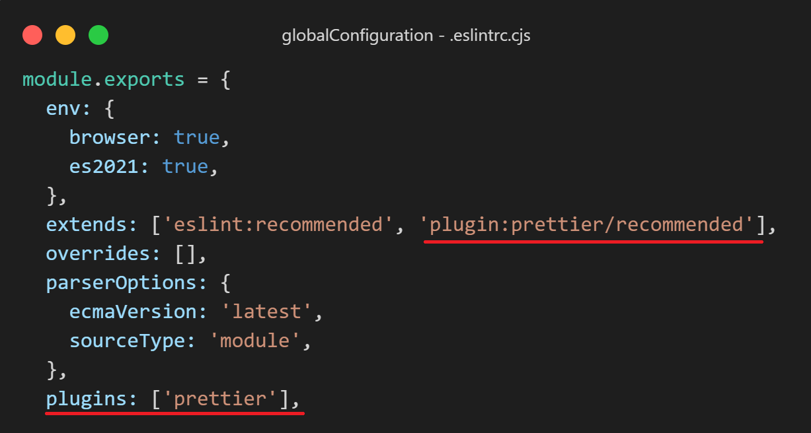

# Pasos configuracion eslint

## [Usando slint](https://eslint.org/docs/latest/user-guide/getting-started)

- Realizamos la configuracion manual:
  - `npm i eslint -D`
  - `npx eslint --init`
  - Se siguen los pasos de la terminal
- Para eliminar regla para todo el proyecto:
  - colocamos el nombre de la regla y ponemos 0
    

## [Configurando slint con prettier](https://prettier.io/docs/en/index.html)

- Realizamos la intalacion y configuracion:
  - `npm i -D prettier eslint-config-prettier eslint-plugin-prettier`
  - Creamos un archivo `.prettierrc.cjs` y agregamos la configuracion
  - Agregamos prettier como plugin y extension en `.eslintrc.cjs`
    

se recomienda crear un archivo `.eslintignore` y poner dentro node_modules

## [Usando standar](https://standardjs.com/)

- Contiene reglas preestablecidas y no requiere configuracion
- Pasos para instalacion y configuracion:
  - `npm i standard -D`
  - Realizamos la configuracion en el package.json como se ve en la sgt. imagen
    
